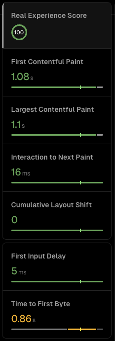
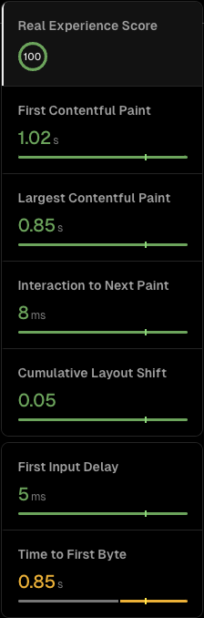

# Nisiman
Source code for [nisiman.xyz](https://nisiman.xyz), my personal website.

## Overview
- `/` - About me
- `/coursework` - My coursework at university and other online courses
- `/cv` - My CV

The website is also a real-time indicator of what song I'm currently playing on Spotify, my recently played tracks, and my top tracks and artists in the last month. This was possible using Serverless functions on Next.js and the Spotify API. 

## Built using

- [TypeScript](https://www.typescriptlang.org/)
- [Next.js](https://nextjs.org/)
- [Tailwind CSS]([https://github.com/Kong/swrv](https://tailwindcss.com/))
- [Spotify API](https://developer.spotify.com/documentation/web-api)
- [Vercel](https://vercel.com/)

This project uses [`next/font`](https://nextjs.org/docs/basic-features/font-optimization) to automatically optimize and load Inter, a custom Google Font.

## To Do

- [ ] Light/Dark theme
- [ ] Integrate blog
- [ ] Spotify add to queue

## Analytics

Here are the recent desktop and mobile analytics for the website from Vercel.

